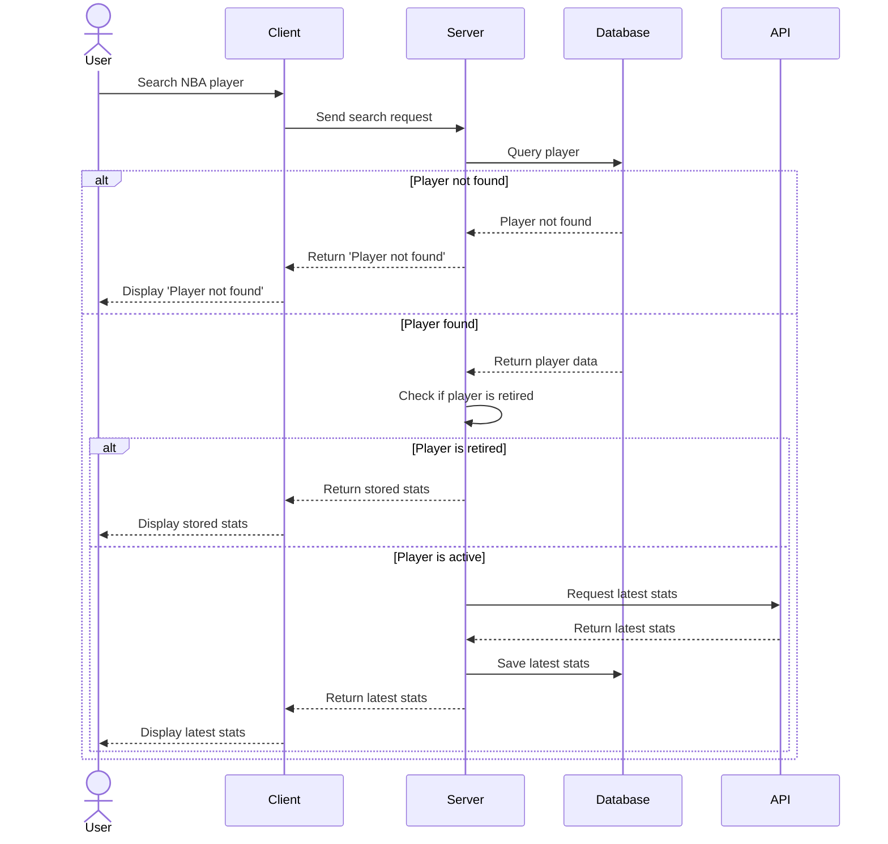

# NBA Player Search System - Sequence Diagram

This sequence diagram demonstrates the process of searching for an NBA player's statistics.

This Markdown content includes:

1. A title and brief description
2. The Mermaid sequence diagram code
3. An explanation of the sequence diagram

The Mermaid syntax for sequence diagrams uses the following elements:

- `actor` for the User
- `participant` for system components
- `->` for synchronous messages
- `-->` for responses
- `alt` and `else` for alternative flows
